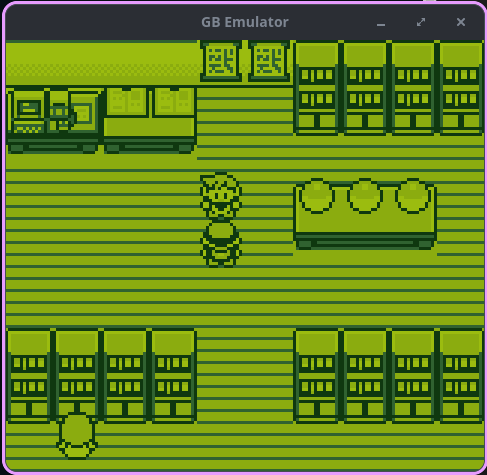

# Game Boy Emulator



A Game Boy (DMG) emulator written from scratch in C.

## Status

Passes Blargg's CPU instruction test ROMs. Audio is not implemented.

## Dependencies

- GCC (C2x)
- SDL2
- Ruby (for generating Unity test runners)

### Installing on Linux

```sh
# Debian/Ubuntu
sudo apt install gcc libsdl2-dev ruby

# Arch
sudo pacman -S gcc sdl2 ruby

# Fedora
sudo dnf install gcc SDL2-devel ruby
```

## Building

```sh
make            # release build  →  build/gb_emulator
make debug      # debug build, no optimizations
make test       # compile and run all tests
make clean      # remove intermediate objects
make distclean  # remove everything including binaries
```

## Running

```sh
make run                        # uses the default ROM
make run ROM=./roms/game.gb     # specify a ROM
```

Defaults to `./roms/test_roms/01-special.gb` if `ROM` is not set.

## Controls

| Key        | Button |
| ---------- | ------ |
| Arrow keys | D-pad  |
| Z          | A      |
| X          | B      |
| S          | Select |
| A          | Start  |

## Architecture

| File            | Responsibility                                        |
| --------------- | ----------------------------------------------------- |
| `src/main.c`    | SDL2 event loop, framebuffer → RGB24 rendering        |
| `src/cpu.c`     | Fetch/decode/execute, interrupts, register helpers    |
| `src/mmu.c`     | Memory map, MBC0/1/3 ROM banking, I/O registers       |
| `src/ppu.c`     | PPU modes 0–3, scanline rendering (BG/Window/Sprites) |
| `src/timer.c`   | Divider and TIMA with falling-edge detection          |
| `src/opcodes.c` | Full opcode dispatch including CB prefix              |
| `src/alu.c`     | Arithmetic/logic ops with flag handling               |
| `lib/types.h`   | All struct definitions (CPU, MMU, PPU, Timer, etc.)   |

The `CPU` struct holds pointers to `MMU`, `PPU`, and `Timer`. All memory access goes through `read_mem` / `write_mem`. The main loop runs `cpu_step → ppu_step → timer_handling` per iteration, passing cycle counts between them.

## Testing

Uses the [Unity](https://github.com/ThrowTheSwitch/Unity) test framework. Test files live in `tests/`, with runners auto-generated via a Ruby script from `scripts/unity/`.

```sh
make test
```

## Known Limitations

- HALT bug not emulated
- PPU mode 3 length is fixed at the minimum (172 cycles)
- No audio
